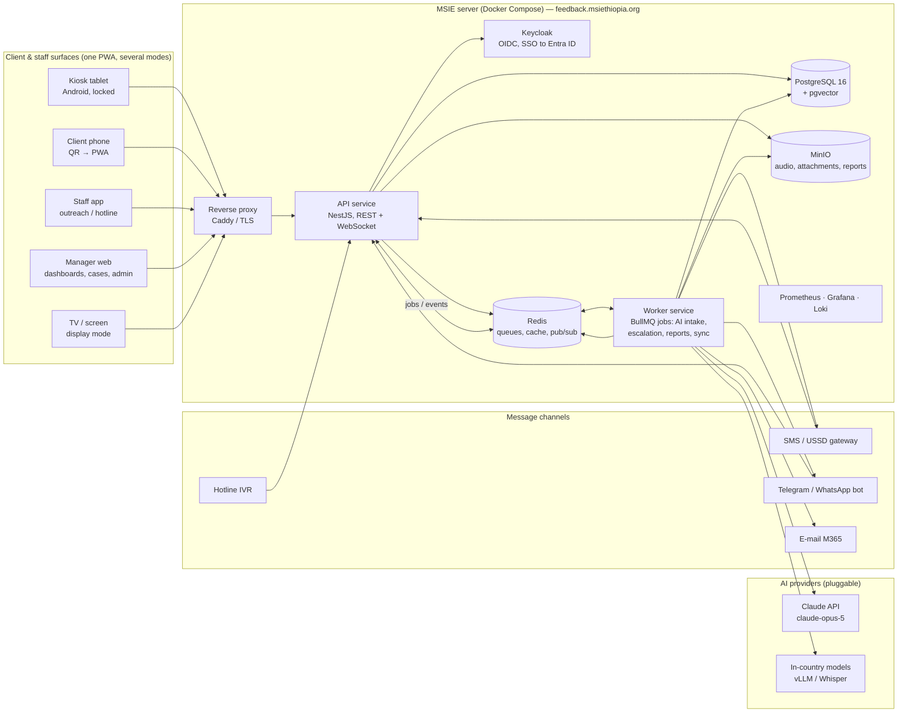

# MSI Ethiopia Client Feedback System (CFS) — Technical Design

| Field | Value |
|---|---|
| Document | Technical Design v0.1 (draft) |
| Date | 2026-09-03 |
| Depends on | `01-business-requirements.md` (requirement IDs FR-*/NFR-* referenced below) |
| Status | Draft for MSIE IT / MSI Global Digital review. Choices marked **[decision]** need MSIE sign-off in discovery. |

---

## 1. Design goals (derived from the BRD)

1. **Offline-first, low-bandwidth clients** on any device (NFR-PERF-1, NFR-SYNC-1).
2. **One codebase, many surfaces**: kiosk, phone, laptop, tablet, TV display, admin.
3. **Multi-tenant** with hard data isolation per country programme (NFR-SCALE-1).
4. **AI as bounded, auditable agents** with a provider abstraction and an in-country option (FR-AI-*, NFR-PRIV-2).
5. **Escalation that cannot be lost**: durable queues, retries, an escalation ladder, and an audit trail (FR-CASE-*).
6. **Deployable by a small IT team on one server**, scalable later (NFR-OPS-1).
7. **Security and privacy by design** for sensitive SRH data (NFR-SEC-*, NFR-PRIV-*).

---

## 2. Architecture overview



**Style**: a modular monolith (API + worker sharing one domain codebase) rather than microservices. It is far easier for MSIE IT to run, and the queue boundary already gives us the split needed to scale workers independently later.

### 2.1 Components

| Component | Technology **[decision]** | Role |
|---|---|---|
| Client app (PWA) | **React 18 + TypeScript + Vite**, service worker (Workbox), IndexedDB (Dexie), i18next (ICU), Web Audio / MediaRecorder | Feedback capture (kiosk/phone/staff), manager web app, display mode — one build, mode chosen by route and device role |
| Native wrapper (optional) | **Capacitor** (Android) | Kiosk lock-task mode, Play Store / sideloaded APK for tablets and Android TV boxes; same web code |
| API | **Node.js 22 + NestJS + TypeScript**, OpenAPI 3.1, Zod validation, Prisma ORM | REST + WebSocket (Socket.IO) API, auth, sync, rules |
| Workers | Same codebase, **BullMQ** on Redis | AI intake pipeline, escalation, digests/reports, media processing, exports |
| Database | **PostgreSQL 16** with `pgvector`, `pgcrypto`, row-level security | System of record, analytics views |
| Cache/queue | **Redis 7** | Job queues, rate limits, pub/sub for live dashboards |
| Object storage | **MinIO** (S3 API) | Audio, photos, generated reports; encrypted buckets |
| Identity | **Keycloak** | OIDC provider; federates to Microsoft Entra ID (MSI M365) and supports local accounts, MFA, device tokens |
| Reverse proxy | **Caddy** (auto-TLS) or Nginx + certbot | TLS termination, HTTP/2, static assets |
| Observability | Prometheus, Grafana, Loki, Alertmanager; Sentry (self-hosted, optional) | Health, alerts to IT |
| AI | Provider abstraction: **Anthropic Claude (`claude-opus-5`)** primary; **in-country**: vLLM-served open-weight LLM + **Whisper large-v3** (or a fine-tuned Ethiopian-language ASR) on a GPU box | Transcription, translation, classification, synthesis |
| Reporting | Headless Chromium (Playwright) for PDF; `exceljs`; `pptxgenjs` | Report packs |
| Infra | Docker Compose (phase 1) → k3s/Helm (multi-country) ; Ubuntu 24.04 LTS | Deployment |

Why these: a single language (TypeScript) front to back keeps the team small; React/Vite PWA has the best offline tooling and a huge hiring pool in Ethiopia; PostgreSQL + Redis + MinIO are boring, free, self-hostable and well documented; Keycloak gives enterprise SSO without a subscription.

Alternatives considered: Django/Python backend (fine, but two languages), Flutter for mobile (strong, but duplicates the web UI and the offline logic), Supabase/Firebase (fast but cloud-only, conflicts with in-country hosting), Metabase/Superset for dashboards (kept as an *optional* analyst tool, not the management UI, because the management dashboards need row-level security, suppression rules and live updates that are simpler to own).

---

## 3. Client applications

### 3.1 One PWA, five modes

| Mode | Route | Auth | Notes |
|---|---|---|---|
| **Client** | `/f/:siteCode` (QR), `/f/:siteCode/:formSlug` | none (anonymous token) | Language picker → consent → form/narrative/voice → thank-you (+ "contact me" option) |
| **Kiosk** | `/kiosk` | device token (paired once) | Fullscreen, idle reset, privacy screen, offline queue, optional "assisted" toggle for staff |
| **Staff** | `/staff` | user login | Proxy entry, hotline logging, paper transcription, verification queue |
| **Manager** | `/app` | user login (SSO) | Dashboards, items, cases, reports, admin |
| **Display** | `/display` | device token (pairing code) | Playlist player, offline cache, no PII |

Build targets: web (all modes), Capacitor Android (kiosk + display + staff). iOS via web only in phase 1.

### 3.2 Offline-first data layer

- **Local store**: IndexedDB via Dexie with tables `outbox`, `forms`, `translations`, `siteConfig`, `snapshots` (dashboard), `media` (audio blobs).
- **IDs**: every record gets a client-generated **UUIDv7** so it can be referenced before the server sees it.
- **Outbox pattern**: submissions are written locally first, then a background sync (Workbox BackgroundSync + a manual retry loop for WebView) POSTs batches to `/sync/push`. Each batch is **idempotent** (server upserts by id; duplicates are no-ops).
- **Media upload**: audio is uploaded separately with the **tus** resumable protocol to MinIO through the API, chunked (256 KB) so it survives flaky links; the feedback item references the media id and is marked `media_pending` until the upload completes.
- **Config pull**: `/sync/pull?since=<cursor>` returns changed forms, translations, site config, playlists; clients can run for weeks on cached config.
- **Conflicts**: feedback items and answers are **append-only** (no conflicts). Case comments and status changes are merged by server timestamp with a full event history (last-write-wins on status, all comments kept). Admin config is server-authoritative.
- **Storage limits**: the app monitors quota; audio recording is refused (with a message) when free storage < 200 MB; items are pruned locally after confirmed server ack.

### 3.3 Voice capture

- `MediaRecorder` → Opus in WebM/OGG (Android/Chrome) or AAC (Safari); server transcodes to 16 kHz mono WAV/FLAC for ASR and keeps an Opus copy for playback.
- Client-side VAD trims silence; max duration and size enforced; waveform + re-listen UI; the client hears the pre-recorded prompt in their language before recording.
- Consent for recording is an explicit tap, stored with the item.

### 3.4 Display mode

- `/display` pairs with a 6-digit code shown in admin; receives a long-lived device token scoped to `display:read` for one site.
- Playlist JSON + pre-rendered slide data + media are cached; the player loops with CSS transitions only (no heavy libraries); refresh every 5 min when online; shows "updated <time>".
- Slides are rendered from **aggregated** API responses that already apply suppression (min n) — there is no endpoint from which a display token can read items.
- Works on Android TV (Capacitor build), any Chromium in kiosk mode, or a Raspberry Pi in `chromium --kiosk`.

### 3.5 Accessibility and localisation

- All strings via i18next with ICU MessageFormat; namespaces per mode to keep the client bundle small.
- Fonts: Noto Sans Ethiopic + Noto Sans (self-hosted, subset); Amharic/Tigrinya on-screen keyboard component for kiosks; `lang` attributes per element for screen readers.
- Audio prompts: human-recorded MP3/Opus per question per language (stored as form assets); TTS is fallback only.
- `prefers-reduced-motion` honoured; focus states; 44 px tap targets; contrast ≥ 4.5:1 with MSI brand colours.

---

## 4. Backend design

### 4.1 Domain modules (NestJS)

`tenants` · `sites` · `identity` (Keycloak adapter, RBAC/ABAC) · `forms` · `feedback` (items, answers, media) · `language` (translations, transcripts) · `ai` (provider abstraction, agents, evals) · `triage` (rules, severity, clustering) · `cases` (workflow, SLA, escalation) · `notify` (e-mail, SMS, Telegram, push) · `analytics` (semantic layer, aggregates, suppression) · `reports` · `display` · `sync` · `integrations` (denominators import, webhooks) · `audit` · `admin`.

### 4.2 Data model (core tables, PostgreSQL)

```
tenant(id, code, name, default_lang, working_langs[], tz, calendar, data_residency, ai_mode, retention_json, branding_json)
region(id, tenant_id, parent_id, name)
site(id, tenant_id, region_id, code, name, type[centre|maternity|outreach|franchise|hotline], service_lines[], langs[], status)
user(id, tenant_id, keycloak_sub, name, email, phone, status)          -- role bindings scoped:
role_binding(id, user_id, role, scope_type[tenant|region|site], scope_id)
device(id, tenant_id, site_id, kind[kiosk|display|staff], name, token_hash, last_seen, config_json)

form(id, tenant_id, slug, name, kind, status)
form_version(id, form_id, version, schema_json, logic_json, published_at)
form_assignment(form_version_id, site_id|region_id|tenant_id, channels[])
translation(id, tenant_id, scope[ui|form|display|notify|taxonomy], key, lang, text, audio_asset_id, status, updated_by)

feedback_item(id uuidv7, tenant_id, site_id, service_line, channel, form_version_id, lang_declared, lang_detected,
              submitted_at, received_at, device_id, assisted_by_user_id, is_identified, consent_json,
              contact_request_json (encrypted), source[app|kiosk|sms|telegram|ivr|paper|staff], status, dedupe_hash)
answer(id, item_id, question_key, value_json)
media(id, item_id, kind[audio|photo], object_key, mime, duration_s, bytes, status[pending|uploaded|processed|deleted], sha256)
transcript(id, media_id, lang, text, engine, model_version, confidence, verified_by, verified_at)
translation_of_text(id, item_id, source_lang, target_lang, text, engine, model_version, confidence, verified_by)
redaction(id, item_id, analysis_text, entities_json, engine)
ai_annotation(id, item_id, kind[classify|sentiment|severity|summary|critical_check], output_json, confidence,
              model, prompt_version, created_at, superseded_by)
taxonomy(id, tenant_id, version, tree_json, keyword_lists_json, status)
human_label(id, item_id, user_id, categories[], severity, notes, created_at)   -- corrections → eval set

case(id, tenant_id, site_id, item_id[], category, severity, sensitivity[normal|restricted|safeguarding],
     status, assignee_id, opened_at, ack_due, ack_at, resolve_due, resolved_at, closed_reason, external_ref)
case_event(id, case_id, type, actor_id, payload_json, at)
escalation_rule(id, tenant_id, match_json, recipients_json, channels[], sla_json, ladder_json, active)
alert(id, case_id, rule_id, tier, channel, recipient, sent_at, delivered_at, acked_at, ack_token_hash, status)
public_action(id, tenant_id, site_id|null, title_by_lang_json, body_by_lang_json, linked_case_id, approved_by, status)
display_playlist(id, tenant_id, site_id|region_id, slides_json, langs[], schedule_json, version)
service_stats(id, tenant_id, site_id, period, service_line, visits)          -- denominators
audit_event(id, tenant_id, actor_type, actor_id, action, object_type, object_id, ip, at, detail_json)
```

Notes:
- **Row-level security** policies on every tenant-scoped table (`tenant_id = current_setting('app.tenant')`), plus site scoping enforced in the service layer from role bindings.
- **Field encryption** (`pgcrypto`, key from the secrets store) for `contact_request_json`, identified answers (phone), and transcript text of restricted cases. Object storage buckets use server-side encryption; keys managed by MSIE.
- **Analytics**: materialised views / a `fact_feedback` table refreshed by workers (theme counts, ratings, per site-day), `pgvector` embeddings for near-duplicate and semantic search. TimescaleDB is optional if volumes grow.
- **Retention** worker deletes audio and identifiers per tenant policy and writes an audit event.

### 4.3 API surface (REST, OpenAPI)

| Group | Endpoints (abridged) |
|---|---|
| Public capture | `GET /pub/site/:code/config` (forms, langs, consent) · `POST /pub/feedback` (single) · `POST /sync/push` (batch, idempotent) · `POST /media/tus/*` (resumable) · `GET /sync/pull?since=` |
| Channels | `POST /channels/sms/inbound` · `POST /channels/telegram/webhook` · `POST /channels/ivr/recording` (signed by provider) |
| Items | `GET /items` (filters, paging, RLS) · `GET /items/:id` · `POST /items/:id/labels` · `POST /items/:id/verify-transcript` |
| Cases | `GET/POST /cases` · `PATCH /cases/:id` · `POST /cases/:id/events` · `POST /cases/:id/handoff` · `GET /alerts/ack/:token` (one-click) |
| Analytics | `GET /analytics/summary` · `GET /analytics/themes` · `GET /analytics/timeseries` · `POST /analytics/ask` (copilot) — all responses carry `n` and apply suppression |
| Reports | `POST /reports/run` · `GET /reports/:id` (signed download) · `GET/POST /reports/schedules` |
| Display | `POST /display/pair` · `GET /display/playlist` (device token) |
| Admin | tenants, sites, users, roles, forms, translations, taxonomy, escalation rules, devices, retention, audit export |
| Integration | `POST /integrations/service-stats/import` · `GET /export/items.csv` · `POST /webhooks` |

Real-time: WebSocket namespace `/live` pushes `item.created`, `case.updated`, `alert.sent` to subscribed dashboards (tenant/site scoped); polling fallback every 30 s.

### 4.4 Authentication and authorisation

- Keycloak realm per deployment; **identity provider = Microsoft Entra ID** of MSI (OIDC), local accounts for non-M365 staff, TOTP MFA required for admin/safeguarding roles.
- Roles (BRD FR-ADM-3) are Keycloak client roles; **scope** (tenant/region/site) lives in `role_binding` and is loaded into the request context.
- Devices use long-lived, revocable tokens (hashed at rest) scoped to `kiosk:submit` or `display:read` for one site.
- Anonymous capture uses a short-lived signed site token embedded in the QR link; rate limited per IP/device.
- Sensitivity gates: `restricted` and `safeguarding` cases require an explicit role; item text/audio access is logged.

### 4.5 Escalation pipeline

```
item.created ─▶ intake queue ─▶ Intake agent ─▶ severity + critical flags
                                   │
                    critical? ─────┴──▶ triage.critical job (priority queue, retries ×5, DLQ)
                                          │
                                          ├─ open case (sensitivity from category)
                                          ├─ match escalation rules → recipients, channels, SLA
                                          ├─ Escalation agent drafts alert (redacted excerpt, actions)
                                          ├─ notify.email + notify.sms (+ telegram/push) with ack tokens
                                          └─ schedule SLA check job (ack_due) → tier 2 → tier 3
```

- Queues are durable in Redis with **AOF persistence**; a nightly job reconciles items with no annotation (safety net).
- Rules-first: per-language critical keyword/phrase lists (maintained in the taxonomy) short-circuit to critical before the model runs, so a model outage never delays a safeguarding alert.
- Alert delivery status (SMTP/Graph result, SMS DLR) is stored; failure to deliver on all channels within 10 min pages IT via Alertmanager.
- One-click acknowledgement: `GET /alerts/ack/:token` (single-use, 72 h expiry) → case `Acknowledged`, SLA stops.

### 4.6 Notification providers

- **E-mail**: Microsoft Graph `sendMail` with an app registration (preferred; DKIM/SPF already MSI's) or SMTP relay. Templates per language (MJML → HTML + plain text).
- **SMS**: provider interface `send(to, text) / inbound webhook / DLR webhook`; adapters for an Ethio Telecom / Safaricom Ethiopia aggregator (HTTP API) and for Africa's Talking / Twilio for other countries.
- **Telegram**: Bot API webhook; conversation state in Redis; voice notes downloaded to MinIO and enter the same intake pipeline.
- **Push**: Web Push (VAPID) for managers' PWA; FCM via Capacitor for Android.

---

## 5. Multilingual implementation

| Concern | Approach |
|---|---|
| UI strings | i18next resources per language, editable in admin (stored in `translation`), exported/imported as XLIFF/CSV for translators |
| Form content | `form_version.schema_json` holds keys; texts live in `translation` with `scope=form`; publishing checks completeness per assigned site language |
| Scripts/fonts | Noto Sans Ethiopic (subset) + Noto Sans; all LTR; Ethiopian calendar display via a small converter for dates shown to clients |
| Input | On-screen keyboards (Amharic/Tigrinya Ethiopic layouts) in kiosk mode; native keyboards on phones |
| Detection | Language declared by the client is primary; `lang_detected` from the model for narratives/voice; mismatch flagged |
| Transcription | Whisper large-v3 (self-hosted) supports Amharic and several Ethiopian languages at variable quality; cloud ASR as an alternative adapter; **pilot measures word-error rate per language on a 200-clip labelled set** and decides per language whether ASR is auto, ASR + human verify, or human-only |
| Translation | LLM translation into working languages with source shown alongside; verification queue for low confidence; glossary of SRH terms per language injected into prompts to keep clinical terms consistent |
| Voice prompts | Human recordings per question and language; managed as form assets; TTS only as fallback |

---

## 6. AI agentic layer

### 6.1 Principles
- **Bounded agents**: each agent has one job, a fixed tool set, a schema-validated output, and a human checkpoint where the BRD requires one.
- **Redact before you send**: the intake pipeline strips personal identifiers and creates an `analysis_text`; only that copy goes to any model, external or local.
- **Provider abstraction**: `AiProvider` interface with `transcribe`, `translate`, `classify`, `summarise`, `answer` implemented by `AnthropicProvider` (Claude API) and `LocalProvider` (vLLM + Whisper). Tenant setting `ai_mode = cloud | local | hybrid` decides routing; `hybrid` uses local ASR and cloud LLM.
- **Everything logged**: model, version, prompt version, tokens, latency, confidence, output; corrections captured as eval data.
- **Fail safe**: if AI is down, items stay `pending_ai`, keyword rules still raise critical alerts, and reviewers can triage manually.

### 6.2 Agents

| Agent | Trigger | Inputs | Tools | Output | Human checkpoint |
|---|---|---|---|---|---|
| **Intake** | `item.created` / media processed | analysis text, transcript, form answers, site & service context, taxonomy v, glossary | none (single structured call after ASR/redaction) | language, translation, categories[], sentiment, severity, critical flags[], summary, confidence, rationale | Reviewer can relabel; low confidence → verification queue |
| **Escalation** | severity = critical | case, item summary, rule match, recipient roles | `send_alert`, `open_case`, `schedule_sla_check` (idempotent, whitelisted) | alert texts per channel/language, first-action checklist | Recipient acknowledges; reviewer can downgrade |
| **Cluster / trend** | hourly | last 7/30 days aggregates per site | SQL over semantic layer (read-only) | trend alerts with evidence | MEL threshold config; alert goes to managers as "trend", not "critical" |
| **Insight** | schedule | aggregates, top themes, verbatims (redacted), open cases | `query_metrics`, `fetch_verbatims` | digest draft (markdown), recommended actions | Manager edits/publishes |
| **Report** | schedule / on demand | template, period, scope | `query_metrics`, `render_chart`, `build_pdf/xlsx/pptx` | report pack | Publisher approves; all numbers from queries |
| **Analyst copilot** | user question | question, user's scope, semantic-layer schema | `run_query` (read-only, RLS, timeout, row cap), `render_chart` | answer + figures + chart + query shown | User sees the query; refuses out-of-scope |
| **Feedback assistant** (phase 3) | client chat/voice turn | conversation, form schema, language | `save_answer`, `escalate_emergency_message` | next prompt, saved answers | Never gives medical advice; emergency template |

### 6.3 Model choice and API usage

- **Primary LLM: `claude-opus-5`** via the official Anthropic SDK (TypeScript). Adaptive thinking on; `effort` tuned per agent (`low` for intake classification at volume, `high` for insight/report drafting). Structured outputs (`output_config.format` with a Zod schema) guarantee machine-readable results for the intake agent; `strict: true` tools for the escalation and copilot agents.
- **Refusal fallbacks** enabled by default (`fallbacks: "default"` with the `server-side-fallback-2026-07-01` beta) so a safety-classifier decline on a graphic abuse narrative still yields a classification rather than a silent gap; a persistent refusal marks the item critical for human review.
- **Prompt caching**: taxonomy, glossary and instructions form a stable cached prefix; the item text comes last.
- **Batch API** for nightly re-classification after a taxonomy change (50 % cost).
- **Local option**: vLLM serving an open-weight instruct model with the same JSON schemas; quality is benchmarked on the same eval set before a tenant switches to `local`.
- **ASR**: Whisper large-v3 self-hosted (GPU recommended: 1× 24 GB card handles pilot volumes; CPU works with delay). Adapter interface allows a cloud ASR where policy permits.

Illustrative intake classification call (TypeScript, official SDK):

```typescript
import Anthropic from "@anthropic-ai/sdk";
import { z } from "zod";
import { zodOutputFormat } from "@anthropic-ai/sdk/helpers/zod";

const IntakeResult = z.object({
  language: z.string(),                       // BCP-47 of the source text
  translation_en: z.string(),
  translation_am: z.string(),
  categories: z.array(z.string()),            // keys from the tenant taxonomy
  sentiment: z.number().min(-1).max(1),
  severity: z.enum(["info", "low", "medium", "high", "critical"]),
  critical_flags: z.array(z.enum([
    "safeguarding", "abuse", "coercion_or_denial", "clinical_harm",
    "confidentiality_breach", "fraud_or_illegal_fees", "discrimination", "threat",
  ])),
  summary: z.string().max(200),
  confidence: z.number().min(0).max(1),
  rationale: z.string().max(400),
});

const client = new Anthropic();

export async function classifyFeedback(analysisText: string, ctx: IntakeContext) {
  const response = await client.beta.messages.parse({
    model: "claude-opus-5",
    max_tokens: 4000,
    betas: ["server-side-fallback-2026-07-01"],
    fallbacks: "default",
    thinking: { type: "adaptive" },
    output_config: { effort: "low", format: zodOutputFormat(IntakeResult) },
    system: [
      // Stable prefix — cached across all items of this tenant/taxonomy version.
      { type: "text", text: ctx.instructions, cache_control: { type: "ephemeral" } },
      { type: "text", text: ctx.taxonomyAndGlossary, cache_control: { type: "ephemeral" } },
    ],
    messages: [{
      role: "user",
      content: `Site type: ${ctx.siteType}; service line: ${ctx.serviceLine}; channel: ${ctx.channel}.\n` +
               `Client feedback (personal identifiers already redacted):\n<feedback>${analysisText}</feedback>`,
    }],
  });

  if (response.stop_reason === "refusal" || !response.parsed_output) {
    return { severity: "critical", critical_flags: ["needs_human_review"], reason: "no_model_output" };
  }
  return response.parsed_output;
}
```

The keyword-rule pass runs before this call and its result is merged with the model's: **either** path raising a critical flag makes the item critical.

### 6.4 Cost model (formula, not a quote)

Per text item on `claude-opus-5` with a cached ~3,000-token prefix and ~500 tokens of item text, ~400 output tokens:
`≈ (3,000 × $0.50 cache-read + 500 × $5 + 400 × $25) / 1,000,000 ≈ $0.014` per item. Voice adds ASR compute (self-hosted: electricity/GPU amortisation; cloud ASR: provider rate per minute). Digests, reports and copilot questions are low-volume, higher-token calls. MSIE will get a sized estimate once expected monthly item volumes are known from discovery.

### 6.5 Evaluation and safety
- **Golden set**: ≥ 300 labelled items per pilot language (real, consented, redacted), stratified by category and severity; measured on every prompt/model change: category F1, severity accuracy, **critical recall ≥ 0.95 as the gate**, translation adequacy sampled by bilingual staff.
- **Prompt versioning** in the repo; changes reviewed like code; A/B on the eval set before promotion.
- **Injection resistance**: feedback text is wrapped as data, never as instructions; the copilot's only tool is a read-only query with RLS and a row cap; outputs are rendered as text, never executed.
- **Drift monitoring**: monthly human-audit sample of 100 items; per-language agreement charts in the MEL dashboard.

---

## 7. Analytics and reporting

- **Semantic layer**: a small set of documented SQL views (`v_items`, `v_themes`, `v_ratings`, `v_cases`, `v_sla`, `v_response_rate`) with tenant/site RLS; used by dashboards, the copilot, reports and the optional Power BI connector — one definition of every metric.
- **Suppression**: `n < threshold ⇒ null` applied in the view layer so no consumer can bypass it.
- **Live updates**: workers publish aggregate deltas to Redis; the API pushes to subscribed dashboards; the client merges into its cached snapshot.
- **Charts**: lightweight (uPlot / Chart.js) with accessible tables behind every chart; consistent colour palette with MSI brand.
- **Reports**: HTML templates rendered by headless Chromium to PDF; `exceljs` for Excel; `pptxgenjs` for PowerPoint; AI narrative sections inserted from the Insight agent draft, marked "AI draft" until published.

### 7.1 Power BI integration (FR-DASH-9, FR-INT-8)

MSIE already uses Power BI for management reporting, so CFS must be a first-class Power BI source rather than a competing dashboard silo. The in-app dashboards remain (they carry live updates, suppression and case workflows); Power BI is where CFS indicators sit **next to** service statistics, finance and HR data.

**Reporting schema.** A dedicated PostgreSQL schema `bi` exposes a documented star model, refreshed by the analytics worker (every 15 min; nightly full rebuild):

| Table | Grain | Key columns |
|---|---|---|
| `bi.fact_feedback` | one row per feedback item | item_key, date_key, site_key, service_line_key, channel_key, language_key, form_key, rating_1_5, recommend_0_10, sentiment, severity, is_critical, is_identified, assisted |
| `bi.fact_feedback_theme` | item × category | item_key, category_key, sentiment |
| `bi.fact_case` | one row per case | case_key, item_key, site_key, category_key, severity, sensitivity, opened/ack/resolved dates, ack_minutes, resolve_hours, sla_met |
| `bi.fact_alert` | one row per alert delivery | alert_key, case_key, tier, channel, sent/delivered/acked timestamps |
| `bi.fact_service_stats` | site × service × month | visits (denominator) |
| `bi.dim_date` (Gregorian + Ethiopian calendar columns), `bi.dim_site` (hierarchy), `bi.dim_service_line`, `bi.dim_channel`, `bi.dim_language`, `bi.dim_category` (taxonomy version), `bi.dim_form` | dimensions | |

Rules: **no free text, no audio references, no identifiers** in `bi.*`; restricted/safeguarding cases appear only as counts with category masked; the suppression threshold is applied in Power BI measures using the `n` columns so small cells show blank.

**Connectivity options** (MSIE chooses in discovery):
1. **On-premises data gateway → PostgreSQL** (recommended for the MSIE-hosted server): a read-only DB role `bi_reader` limited to `bi.*`; Power BI **import** mode with scheduled refresh (8×/day on Pro) or **DirectQuery** for near-real-time pages. TLS to the database; gateway runs on an MSIE Windows host.
2. **REST/OData feed**: `GET /bi/odata/*` from the CFS API (same schema) for environments without a gateway; token-authenticated.
3. **Scheduled extract** to a SharePoint/OneDrive folder (Parquet/CSV) for lightweight use.

**Row-level security.** Power BI RLS roles mirror CFS scopes: a `dim_user_scope` table (user principal name → site keys, exported from role bindings) drives `USERPRINCIPALNAME()` filters so a Centre Manager sees only their sites in Power BI as they do in CFS.

**Starter template.** A `.pbit` shipped with the release with pages: Overview (volume, response rate, satisfaction, recommend score), Themes (category frequency × sentiment, trend), Sites (comparison with confidence bands, management-only), Critical & Cases (counts, time-to-acknowledge, SLA compliance), Languages & Channels (equity view), Data Quality (AI agreement, verification backlog). Measures are written once in DAX and documented so MSIE analysts can extend them and merge the pages into the existing management reports.

**Embedding.** Two directions, both optional: (a) an existing MSIE Power BI report embedded in the CFS manager app via Power BI Embedded / "embed for your organisation" (requires Pro/PPU licences for viewers and Entra ID single sign-on, which Keycloak federation already provides); (b) CFS in-app visuals opened from a Power BI page by deep link. Neither replaces the in-app dashboards for operational use.

**Governance.** The `bi.*` schema is versioned with the release; breaking changes are announced with one release of overlap; the semantic-layer views in §7 and the `bi.*` tables use the same metric definitions so figures match between CFS and Power BI.

---

## 8. Security and privacy controls

| Area | Control |
|---|---|
| Transport | TLS 1.2+ (Caddy auto-certs or MSI-issued certificate), HSTS, secure cookies, CSP |
| App security | OWASP ASVS L2 checklist; Zod validation on every input; parameterised queries (Prisma); rate limiting; CSRF for browser sessions; dependency scanning (npm audit, Trivy on images); SAST in CI |
| Identity | Keycloak OIDC; MFA for privileged roles; short-lived access tokens, rotating refresh tokens; device tokens revocable |
| Data | RLS by tenant; site scoping; field-level encryption for identifiers and audio references; MinIO SSE; disk encryption (LUKS) on the server |
| AI data flow | Redaction before model calls; only `analysis_text`; DPA with the provider; no training on MSI data; `local` mode for full in-country processing |
| Audit | Immutable append-only `audit_event` (no UPDATE/DELETE grants), including reads of identified data and audio |
| Retention | Per-tenant policy job; audio deletion after verified transcript; identified data purge; anonymised aggregates retained |
| Backups | Encrypted nightly `pg_dump` + continuous WAL archiving (WAL-G) and MinIO replication to an off-site bucket (second MSIE location or MSI Global cloud) |
| Secrets | Docker secrets / SOPS-encrypted env files; no secrets in the repo; quarterly rotation |
| Kiosk hardening | Android lock-task mode, no browser escape, auto-update, remote disable; privacy screen filter recommended on hardware |
| Public display | Read-only aggregate endpoint; content approval workflow; device token per screen |
| Governance | DPIA before pilot; data-protection officer named; breach runbook aligned to Proclamation 1321/2024 timelines |

---

## 9. Hosting and operations

### 9.1 Primary option — MSI Ethiopia server, MSIE domain **[decision]**

- **Hardware/VM (pilot → national)**: 8 vCPU, 32 GB RAM, 500 GB NVMe SSD, Ubuntu 24.04 LTS; add a GPU host (or a second server with 1× 24 GB GPU) for in-country ASR/LLM if `local` AI mode is chosen. UPS and a stable uplink with a public IP (or reverse tunnel/Cloudflare Tunnel if inbound is blocked).
- **Domain**: `feedback.msiethiopia.org` (placeholder; MSIE decides) with DNS managed by MSIE; short-link domain optional for QR codes.
- **Deployment**: `docker compose up -d` from a versioned release; services: caddy, api, worker, keycloak, postgres, redis, minio, grafana stack. Zero-downtime upgrade for clients (offline capture continues during API restarts; migrations are backward-compatible for one version).
- **Backups & DR**: nightly encrypted backups to off-site MinIO; restore drill quarterly; RPO ≤ 1 h (WAL), RTO ≤ 8 h.
- **Monitoring**: Grafana dashboards, Alertmanager → IT e-mail/Telegram; synthetic checks for capture endpoint and alert delivery.

### 9.2 Alternatives
- **Ethiopian cloud / data centre** (e.g. Ethio Telecom cloud or a local hosting provider): same Compose stack, keeps data in-country, better power/network.
- **MSI Global cloud** (Azure/AWS): easiest for multi-country and DR; requires data-transfer sign-off under Ethiopian law; Helm chart on managed Kubernetes; managed PostgreSQL.
- **Hybrid**: primary in Ethiopia, encrypted backups and disaster-recovery replica in MSI Global cloud.

### 9.3 Multi-country topology
- **Shared multi-tenant deployment** (one platform, tenant per country) for programmes that accept MSI Global hosting, **or** a **per-country deployment** of the same release (Helm/Compose) where residency requires it. Both use identical code; a global read-only aggregation service pulls approved indicators from each deployment via the export API.

---

## 10. Engineering process

- **Repository**: MSI-owned Git monorepo (`apps/web`, `apps/api`, `packages/domain`, `packages/ui`, `infra`), MIT-compatible dependencies only (licence audit in CI).
- **CI/CD** (GitHub Actions or GitLab CI): lint, typecheck, unit + integration tests (Testcontainers Postgres/Redis), Playwright e2e (kiosk offline flow, escalation flow, display mode), accessibility checks (axe), Lighthouse budget for the client PWA, container build, SBOM, signed release.
- **Environments**: dev → staging (MSIE staging server or cloud) → production; feature flags per tenant.
- **Testing of AI**: eval suite in CI (golden set, critical recall gate); prompt changes require eval run.
- **Load test**: 5,000-item offline batch sync; 200 concurrent dashboards; 100 voice uploads/hour.
- **Definition of done** per feature: tests, docs, translations keys, audit events, RLS check, a11y check.

### 10.1 Indicative work breakdown (Phase 1 MVP, ~10–12 weeks)

| Sprint | Deliverables |
|---|---|
| 1 | Repo, CI, Compose stack, Keycloak SSO, tenant/site/user model, admin skeleton |
| 2 | Form builder v1 + translations, client PWA capture (forms, narrative), offline outbox + sync |
| 3 | Voice capture + tus upload + media pipeline; kiosk mode; QR links |
| 4 | AI intake (redaction, ASR adapter, classify, translate) + verification queue |
| 5 | Triage rules, cases, escalation matrix, e-mail/SMS alerts, SLA ladder |
| 6 | Dashboards (site/national), live updates, suppression, exports |
| 7 | Display mode + playlist admin + "You said → We did"; daily digest (Insight agent) |
| 8 | Hardening: security review, backups/DR, monitoring, a11y audit, load test, UAT fixes, pilot training material |

---

## 11. Risks specific to the technical approach

| Risk | Mitigation |
|---|---|
| ASR quality for Ethiopian languages below usable threshold | Per-language decision after pilot WER test; human-first mode; text/staff-assisted fallbacks; consider fine-tuning with consented MSIE audio in Phase 2 |
| Server internet/power at MSIE | Offline capture everywhere; alert channels via provider APIs that retry; hybrid DR option |
| Cloud AI restricted by data-protection ruling | `local` mode designed in from the start; redaction and DPA for cloud; decision logged in DPIA |
| Kiosk tablets stolen/damaged | Device tokens scoped and revocable; no PII on device beyond the queued items (encrypted at rest on Android); remote disable |
| Alert delivery failures (SMS gateway down) | Multi-channel, DLR tracking, IT paging, escalation ladder |
| Complexity for a small IT team | Single-server Compose, runbooks, managed upgrades, optional support contract |

---

## 12. Decisions needed from MSIE (technical)

1. Hosting option (§9.1–9.3) and domain name.
2. AI mode per data-protection ruling: `cloud`, `local`, or `hybrid`; GPU availability if local.
3. Identity: Entra ID federation approval and who administers Keycloak.
4. SMS gateway provider and short code; Telegram bot ownership.
5. Kiosk/TV hardware standard (Android tablet model, Android TV box vs. Chromium device).
6. Backup destination (second site, MSI Global cloud) and DR expectations.
7. Power BI: gateway host and workspace, import vs DirectQuery, which existing reports the CFS pages join, and licensing for embedding (§7.1).
